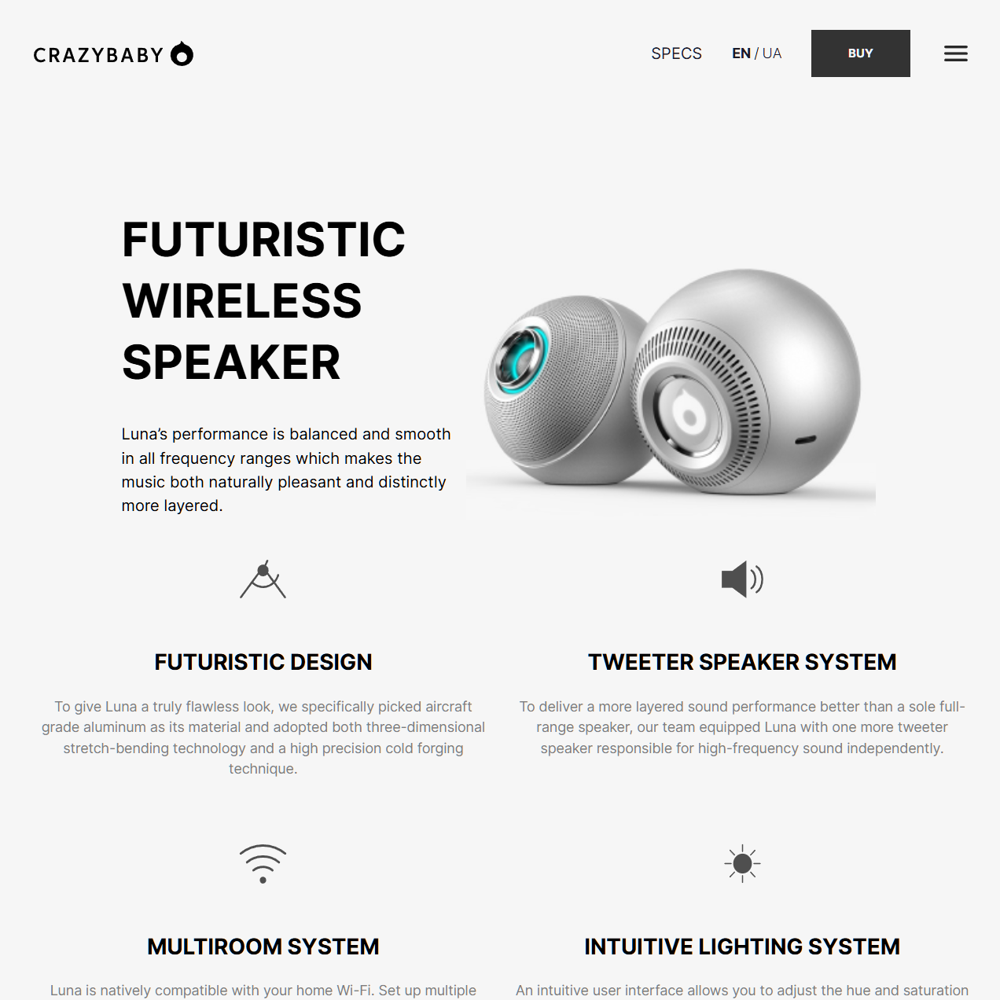

# Crazybaby Landing Page

[](https://www.gnu.org/licenses/gpl-3.0)
[](https://developer.mozilla.org/en-US/docs/Web/Guide/HTML/HTML5)
[](https://sass-lang.com/)
[](https://developer.mozilla.org/en-US/docs/Web/JavaScript)
[](https://parceljs.org/)

This is a demo project for a landing page of a futuristic wireless speaker called "Luna". It is built with modern web technologies and serves as a portfolio piece, showcasing a sleek and responsive design.

This project is a comprehensive landing page designed to showcase the "Luna" wireless speaker. It emphasizes a user-friendly experience with intuitive navigation, detailed feature descriptions, and a visually appealing layout. The application is built with a strong focus on modern web development practices, ensuring responsiveness across devices.

## 🚀 Live Demo

[Link to live demo](https://crazybaby-landing.podolskiy.dev/)

Project Link: [GitHub](https://github.com/syavaYki/crazybaby-landing)

## 📸 Screenshot



## ✨ Features

- **Futuristic Design:** A sleek and modern design that reflects the innovative nature of the product.
- **Responsive Layout:** The landing page is fully responsive and looks great on all devices.
- **Interactive Elements:** Engaging interactive elements like a slider for features and smooth scrolling.
- **Detailed Feature Sections:** Sections dedicated to showcasing the key features of the Luna speaker:
  - Futuristic Design
  - Tweeter Speaker System
  - Multiroom System
  - Intuitive Lighting System
- **Sound & Music Features:** A comprehensive list of sound and music capabilities.
- **Connectivity Options:** Information on Bluetooth and Wi-Fi connectivity.
- **App Integration:** Details about the accompanying mobile app features.
- **Contact Form:** A functional contact form for user inquiries.

## 🛠️ Tech Stack

### Core

- **[HTML5](https://developer.mozilla.org/en-US/docs/Web/Guide/HTML/HTML5):** For the structure of the landing page.
- **[Sass/SCSS](https://sass-lang.com/):** A CSS preprocessor for more maintainable and powerful stylesheets.
- **[JavaScript (ES6+)](https://developer.mozilla.org/en-US/docs/Web/JavaScript):** For interactivity and dynamic content.

### Development & Build

- **[Parcel](https://parceljs.org/):** A fast build tool and development server.
- **[ESLint](https://eslint.org/):** For identifying and reporting on patterns found in ECMAScript/JavaScript code.
- **[Prettier](https://prettier.io/):** An opinionated code formatter.
- **[Stylelint](https://stylelint.io/):** A mighty, modern linter that helps you avoid errors and enforce conventions in your styles.

## 🏁 Getting Started

To get a local copy up and running, follow these simple steps.

### Prerequisites

- Node.js
- npm

### Installation

1. **Clone the repo**

   ```sh
   git clone https://github.com/your_username/crazybaby-landing.git
   ```

2. **Navigate to the project directory**

   ```sh
   cd crazybaby-landing
   ```

3. **Install NPM packages**

   ```sh
   npm install
   ```

### Running the Application

To start the development server, run:

```sh
npm start
```

This will open the app in your default browser.

## 📜 Available Scripts

In the project directory, you can run:

- `npm start`: Runs the app in the development mode.
- `npm run build`: Builds the app for production to the `dist` folder.
- `npm run lint`: Lints the code using ESLint, Prettier, and Stylelint.
- `npm test`: Runs the linters.

## 📄 License

This project is licensed under the **GNU General Public License v3.0**. See the `LICENSE` file for more details.

## 👤 Contact

[Seva Podolskiy] - [svyatoslav.podolskiy@gmail.com](mailto:svyatoslav.podolskiy@gmail.com)
